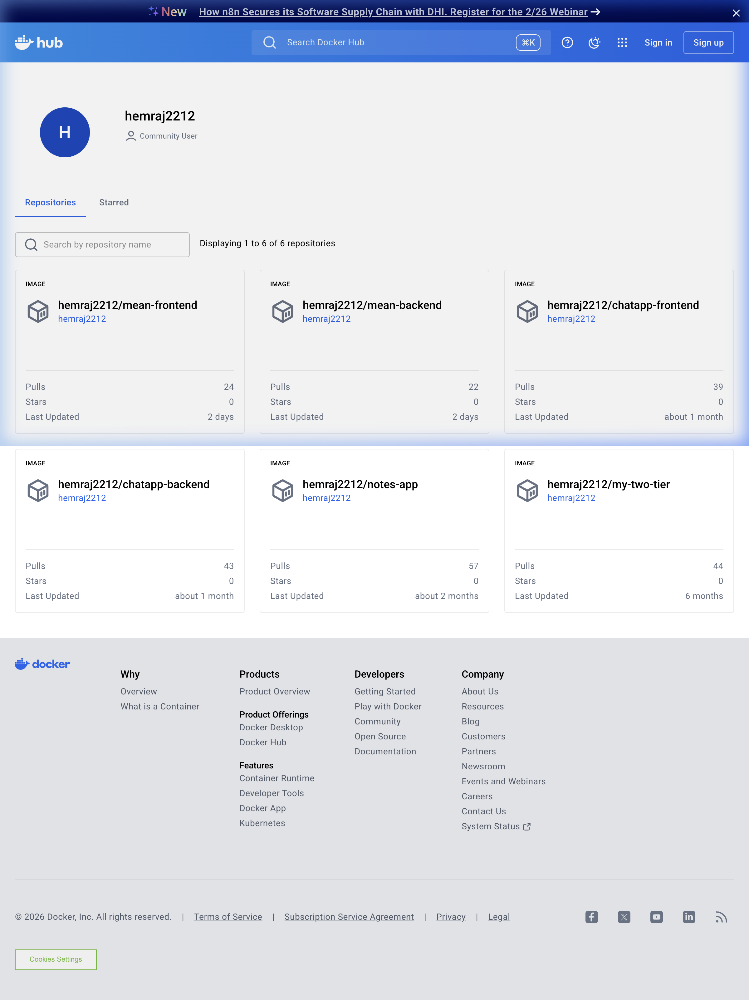
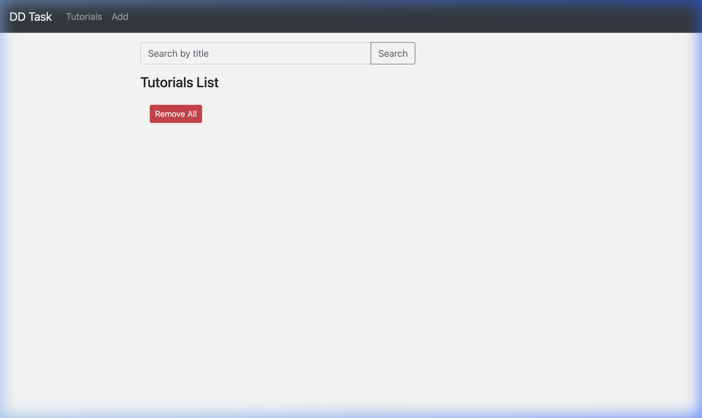
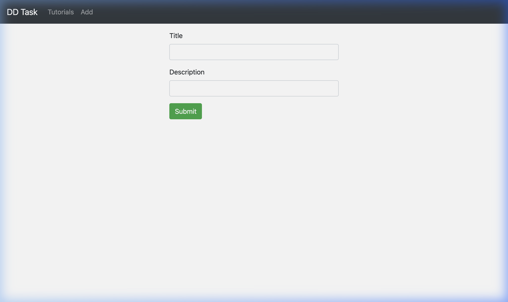

# 📦 MEAN Stack CRUD Application - DevOps Deployment

A full-stack MEAN (MongoDB, Express, Angular 15, Node.js) CRUD application for managing tutorials. Containerized with Docker and deployed with CI/CD pipeline.

## 📋 Table of Contents

- [Architecture Overview](#architecture-overview)
- [Tech Stack](#tech-stack)
- [Project Structure](#project-structure)
- [Local Development Setup](#local-development-setup)
- [Docker Setup](#docker-setup)
- [Cloud VM Deployment](#cloud-vm-deployment)
- [CI/CD Pipeline](#cicd-pipeline)
- [Nginx Reverse Proxy](#nginx-reverse-proxy)
- [Screenshots](#screenshots)

---

## 🏗️ Architecture Overview

```
                    ┌─────────────────┐
                    │   Port 80       │
                    │   Nginx Proxy   │
                    └────────┬────────┘
                             │
                ┌────────────┼────────────┐
                │            │            │
         ┌──────▼──────┐  ┌──▼───────┐   │
         │  Frontend   │  │ Backend  │   │
         │  Angular 15 │  │ Express  │   │
         │  (Nginx)    │  │ Node.js  │   │
         │  Port 4200  │  │ Port 8080│   │
         └─────────────┘  └────┬─────┘   │
                               │         │
                         ┌─────▼─────┐   │
                         │  MongoDB  │   │
                         │ Port 27017│   │
                         └───────────┘   │
                                         │
              Docker Compose Network ────┘
```

## 🛠️ Tech Stack

| Component       | Technology         |
|----------------|--------------------|
| Frontend       | Angular 15         |
| Backend        | Node.js + Express  |
| Database       | MongoDB 6.0        |
| Containerization| Docker + Docker Compose |
| Reverse Proxy  | Nginx              |
| CI/CD          | GitHub Actions      |
| Cloud          | AWS/Azure Ubuntu VM |

## 📁 Project Structure

```
crud-dd-task-mean-app/
├── .github/
│   └── workflows/
│       └── ci-cd.yml              # GitHub Actions CI/CD pipeline
├── backend/
│   ├── app/
│   │   ├── config/db.config.js    # MongoDB connection config
│   │   ├── controllers/           # API controllers
│   │   ├── models/                # Mongoose models
│   │   └── routes/                # API routes
│   ├── server.js                  # Express server entry point
│   ├── package.json
│   ├── Dockerfile                 # Backend Docker image
│   └── .dockerignore
├── frontend/
│   ├── src/
│   │   └── app/
│   │       ├── components/        # Angular components
│   │       ├── models/            # Data models
│   │       └── services/          # API services
│   ├── angular.json
│   ├── package.json
│   ├── Dockerfile                 # Frontend Docker image (multi-stage)
│   ├── nginx.conf                 # Frontend Nginx config
│   └── .dockerignore
├── nginx/
│   └── default.conf               # Reverse proxy Nginx config
├── docker-compose.yml             # Docker Compose configuration
├── .gitignore
└── README.md
```

---

## 💻 Local Development Setup

### Prerequisites
- Node.js (v18+)
- MongoDB (local or cloud)
- Angular CLI (`npm install -g @angular/cli`)

### Backend Setup
```bash
cd backend
npm install
# Update MongoDB URL in app/config/db.config.js if needed
node server.js
# Server runs on http://localhost:8080
```

### Frontend Setup
```bash
cd frontend
npm install
ng serve --port 8081
# App runs on http://localhost:8081
```

---

## 🐳 Docker Setup

### Prerequisites
- Docker (v20+)
- Docker Compose (v2+)

### Build and Run with Docker Compose

```bash
# Sab containers ek saath start karo
docker compose up -d --build

# Status check karo
docker compose ps

# Logs dekho
docker compose logs -f

# Band karo
docker compose down
```

### Access the Application
- **Full Application (via Nginx)**: `http://localhost:80`
- **Frontend (direct)**: `http://localhost:4200`
- **Backend API (direct)**: `http://localhost:8080`
- **MongoDB**: `localhost:27017`

### Build and Push Docker Images Manually

```bash
# Docker Hub login
docker login

# Backend image build aur push
docker build -t YOUR_DOCKERHUB_USERNAME/mean-backend:latest ./backend
docker push YOUR_DOCKERHUB_USERNAME/mean-backend:latest

# Frontend image build aur push
docker build -t YOUR_DOCKERHUB_USERNAME/mean-frontend:latest ./frontend
docker push YOUR_DOCKERHUB_USERNAME/mean-frontend:latest
```

---

## ☁️ Cloud VM Deployment

### Step 1: Ubuntu VM Setup (AWS/Azure)

```bash
# VM pe SSH se connect karo
ssh -i your-key.pem ubuntu@YOUR_VM_IP

# System update karo
sudo apt update && sudo apt upgrade -y

# Docker install karo
sudo apt install -y docker.io docker-compose-plugin
sudo systemctl start docker
sudo systemctl enable docker
sudo usermod -aG docker $USER
newgrp docker

# Git install karo
sudo apt install -y git
```

### Step 2: Application Deploy Karo

```bash
# Repository clone karo
git clone https://github.com/YOUR_USERNAME/crud-dd-task-mean-app.git
cd crud-dd-task-mean-app

# Docker Hub username set karo
export DOCKERHUB_USERNAME=your_dockerhub_username

# Application start karo
docker compose up -d

# Check karo sab chal raha hai
docker compose ps
```

### Step 3: Firewall Configure Karo

```bash
# Port 80 (HTTP) allow karo
sudo ufw allow 80/tcp
sudo ufw allow 22/tcp
sudo ufw enable
```

Ab browser mein `http://YOUR_VM_IP` pe application accessible hoga!

---

## 🔄 CI/CD Pipeline

### GitHub Actions Pipeline Kaise Kaam Karta Hai

```
Code Push to GitHub (main branch)
        │
        ▼
┌─────────────────────────────┐
│ Job 1: Build & Push         │
│ ● Code checkout             │
│ ● Docker Hub login          │
│ ● Build backend image       │
│ ● Build frontend image      │
│ ● Push images to Docker Hub │
└──────────────┬──────────────┘
               │
               ▼
┌─────────────────────────────┐
│ Job 2: Deploy               │
│ ● SSH connect to VM         │
│ ● Pull latest code          │
│ ● Pull latest Docker images │
│ ● Restart containers        │
│ ● Clean old images          │
└─────────────────────────────┘
```

### GitHub Secrets Configure Karo

GitHub repository mein **Settings → Secrets and Variables → Actions** pe jao aur ye secrets add karo:

| Secret Name         | Description                           | Example                     |
|---------------------|---------------------------------------|-----------------------------|
| `DOCKERHUB_USERNAME`| Docker Hub ka username                | `hemrajborane`              |
| `DOCKERHUB_TOKEN`   | Docker Hub Access Token               | `dckr_pat_xxxxx`            |
| `VM_HOST`           | VM ka public IP address               | `52.66.xx.xx`               |
| `VM_USERNAME`       | VM ka SSH username                    | `ubuntu`                    |
| `VM_SSH_KEY`        | VM ka private SSH key (full content)  | `-----BEGIN RSA PRIVATE...` |

### Docker Hub Access Token Kaise Banayein
1. [Docker Hub](https://hub.docker.com) pe login karo
2. **Account Settings → Security → New Access Token**
3. Token generate karo aur copy karke GitHub secret mein paste karo

---

## 🔀 Nginx Reverse Proxy

Nginx ek single entry point hai port **80** pe:

| URL Path    | Redirect To                | Service   |
|-------------|---------------------------|-----------|
| `/`         | `http://frontend:80`      | Angular   |
| `/api/*`    | `http://backend:8080`     | Express   |

**Benefits:**
- ✅ Single port (80) se poora application accessible
- ✅ CORS issues eliminate
- ✅ Clean URL structure
- ✅ Easy SSL setup (future mein)

---

## 📸 Screenshots

### 1. Docker Hub Repositories


### 2. Application Running on AWS (Tutorials List)


### 3. Application Running on AWS (Add Tutorial)


---

## 🧹 Useful Commands

```bash
# Sab containers ka status dekho
docker compose ps

# Specific container ke logs dekho
docker compose logs backend
docker compose logs frontend
docker compose logs mongodb

# Container ke andar jao (debugging ke liye)
docker exec -it backend sh
docker exec -it mongodb mongosh

# Sab band karo (data safe rahega)
docker compose down

# Sab band karo AUR data bhi delete karo
docker compose down -v

# Images rebuild karo
docker compose up -d --build
```

---

## ⚠️ Important Notes

1. **Cloud infrastructure delete mat karo** - Next round mein live demo dena pad sakta hai
2. Server stop kar sakte ho, but restart karne ready rakho
3. `docker compose up -d` se kabhi bhi restart kar sakte ho

---

## 👨‍💻 Author

**Hemraj Borane**

---
